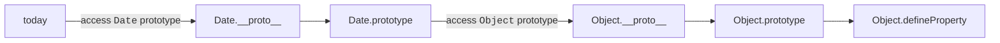
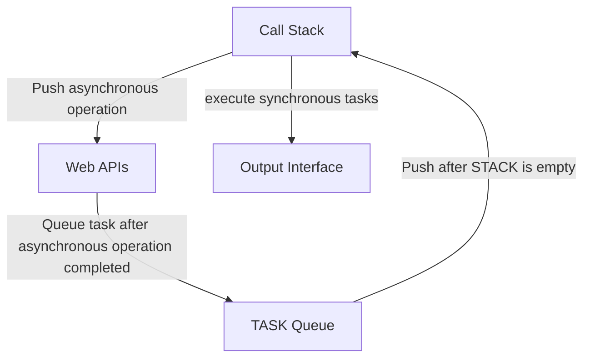
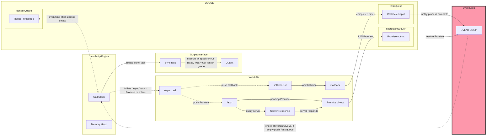

# Practice Platforms 
- [CodeWars](https://www.codewars.com/users/prak112/stats) 
- Chrome Browser console (Best debugger ever!)
    - *in a new Chrome browser tab, just press F12*
- VS Code

# Contents
- [Data types, Operators](#data-types-operators)
- [`this` keyword](#this-keyword)
- [OBJECTS](#objects)
- [`Object` Prototypes](#object-prototypes)
- [Classes](#classes)
- [`Prototype` vs `Class`](#prototype-vs-class)
- [JSON](#json)
- [Closures (*DIVE-IN*)](#closures-dive-in)
- [Hoisting](#hoisting)
- [Event Loop](#event-loop)
- [Asynchronous Javascript](#asynchronous-javascript)


<br>
<hr>

# Concepts Learned
- Check [CS50 W README](https://github.com/prak112/cs50-webdev/blob/main/javascript/README.md) for :
    - Functions
    - DOM and EventHandling<!--to add description/example-->
    - AJAX
    - Promise <!--refine understanding-->

<br>
<hr>
<hr>

## Data Types, Operators
### Primitive
- Hold data such as values, not Properties (keys) or Methods
- Immutable, non-referential
- Primitive Data Types are :
    - `Number` (64 bit-floating point), (exception `NaN`)
    - `String`
    - `Boolean`
    - `null`
    - `undefined`
    - `Symbol` - represents a unique identifier. 
        - for example, to provide unique `object` property name and prevent over-writing them
        ```javascript
            let id = Symbol('id');
            let user = {
                name: 'John',
                [id]: 123 // this is a unique identifier
            };
        ```
    - `BigInt` - modern 64 bit-floating point for precision values beyond `Number` capacity, i.e., to represent
        - integers > `Number.MAX_SAFE_INTEGER (2^53 + 1 or 9007199254740991)`
        - integers < `Number.MIN_SAFE_INTEGER (-2^53 + 1 or -9007199254740991)`

### Non-Primitive/Reference
- Reference the location of data stored in memory 
- Data can be values, Properties, Methods 
    - `Object` - (object, Array, Date)
    - `function()`
    - `RegExp`
    - `Map`
    - `Set`
    - `Promise`

### Operators 
- Symbols used for arithmetic expressions/operations
    ```javascript
    +
    -
    /
    *
    typeof (exception)
    ```

<br>

[Back To Contents](#contents)
<br>
<hr>

## `this` keyword
- Example to represent a general use-case :
```javascript
	const person = {
  	 firstName: "John",
  	 lastName : "Doe",
  	 id       : 5566,
  	 fullName : function() {
  	 	 return this.firstName + " " + this.lastName;
  	 	}
	};
```
- `global object` - an object that always exists in global scope, variables with 'var' keyword are members
- `this` keyword refers to different `global object` in different contexts 
	- In object method : `this` refers to object, i.e., person
	- In function (without 'strict mode') and in global scope : refers to `global object`,
	- In function (with `strict mode`) : `undefined`,
	- In an event : refers to the element that has been triggered/received the event,
	- Methods used for EXPLICIT BINDING (`call(), apply(), bind()`) can refer `this` to any object.
- **IMPLICIT BINDING**
    ```javascript
        const obj = {
            'foo': 1, 
            'bar': 2, 
            'biz': function(){ 
                    return this.foo + this.bar;
                    }
            };
        obj.biz() 	// returns 3
    ```
- **EXPLICIT BINDING**
    ```javascript
        const objFoo = {
            'foo': 5,
                'bar': 25
            };
        obj.biz.call(objFoo);	// returns 30
    ```
- Order of Precedence for `this`

    | Precedence |  Object |
    | ---------  | ------- |
    |	1	|	`bind()` (inside a function) |
    |	2	| 	`apply()` and `call()` (inside a function) |
    |	3	| 	Object method |
    |	4	| 	Global scope |

<br>

[Back To Contents](#contents)
<br>
<hr>

## OBJECTS
- In JavaScript, almost "everything" is an object, i.e., Datatypes and their values,
	- `Boolean` can be objects (if defined with the `new` keyword)
	- `Number` can be objects (if defined with the `new` keyword)
	- `String` can be objects (if defined with the `new` keyword)
	- `Date` are always objects
	- `Math` are always objects
	- Regular expressions (`RegExp`) are always objects
	- `Array` are always objects
	- `Function` are always objects
	- `Object` are always objects

- **!! All JavaScript values, except primitives, are `objects`.**

- An `Object` can be defined using :
    -  object literal - `{}`
    -  `new Object()`
    -  Class `constructor`
    -  `Object.create()`


### Properties
- Property has a **name** and a corresponding **value**
    - for ex. `{id: 1, name: "Rambabu"}` 
    - **name** = `id/name`, **value** = `1/"Rambabu"` 
- Property also has other corresponding attributes (`enumerable, configurable, writable`)
- Property value CAN be modified IF `writable = true`
- `Object` inherits Properties from its [`PROTOTYPE`](#prototypes)


### Accessors - Getters, Setters
- Different from 'Object Methods'
- Used for secure data access and data quality
- Simpler syntax to access Properties
- Accessors can be defined as follows :
	- during `Object` defintion
    ```javascript
        const person = {
            "firstName": "foo",
            "lastName": "bar",
            getFullName() { 
                return (this.firstName + ' ' + this.lastName);
            },
            age: 0,
            setAge(birthYear) {
                this.age = (new Date().getFullYear() - birthYear);
            }
        };
    ```
	- externally using `Object.defineProperty(ObjectName, PropertyName, Getter/Setter definition)`
    ```javascript
		Object.defineProperty(person, "fullName", 
            { get: function() {
                return (this.firstName + ' ' + this.lastName); 
                } 
            });
    ```

### Constructor
- Useful for creating objects based on a template `object`
- Similar to `<List>`in C#
- Example `object` constructor :
```javascript
	function Person(name, birthYear, nationality){
		this.name = name;
		this.year = birthYear;
		this.nationality = nationality;
		
		// Getter or Setter properties can also be set
		Object.defineProperty(this, 'age', { 
			function() { 
				return (new Date.getFullYear() - this.year); }
			});
		
		// Property methods can also be set
        ...
	}
```

### Object Iterables
- `Symbol.iterator` = static data property, also represented as  `@@iterator`
- Used to customise iteration based on requirements
- EXAMPLE :
```javascript
    const iterable = { data: [2, 4, 6] };
    iterable[Symbol.iterator] = function* () {
                        for (let val of this.data){
                        yield val * 2;
                    }					
                    };
    console.log([...iterable]); // Expected output: [4, 8, 12];
```

<br>

[Back To Contents](#contents)
<br>
<hr>

## Object PROTOTYPES
- **!! All JavaScript objects inherit properties and methods from their Object Prototypes**
- EXAMPLE : 
	- `Date` objects inherit from `Date.prototype`
	- `Array` objects inherit from `Array.prototype`
	- `userDefined` objects inherit from `userDefined.prototype`
- Prototypes are similar to a blueprint of a JavaScript object
- Using Prototypes, we can add new Properties or Methods to Object constructors
- EXAMPLE :
	```javascript
    function Person(name, age, nationality){ 
    		this.name = name;
    		this.age = age;
    		this.nationality = nationality;
    	}
    	// add new property to Person
    	Person.prototype.gender = '';
    
    	// define setter function for Person.gender
    	Object.defineProperty(Person.prototype, 'setGender', { set: function(input) { this.gender = input.toUpperCase(); } });
    ```
- Object Methods, if relevant can be added to other object Prototypes through either `Object.assign(ObjectConstructor.prototype, objectMethod)` or directly
- EXAMPLE :
	```javascript
    const greetMethod = { greet() {
         return `Hello, ${this.name} !`; 
        }, 
    };
    
    function Person(name, age) {
        this.name = name;
        this.age = age;
    }
    
    // Prototype method assignment
    Object.assign(Person.prototype, greetMethod);

    // or directly,
    // Person.prototype.greet = greetMethod.greet;
    ```

### Prototype Chain
- Every `object` has a built-in property called `.__proto__` to access its own specific Prototype
- However, Prototype itself is an `object` which will have its own `.__proto__`
- Enter the "**Prototype Chain**" 
	- Newly created Prototype/`object` does not consist of all the Prototype methods. 
    - Hence it looks up the hierarchy of the object Prototype.
	- All the Prototype objects are linked through '__proto__' property.
EXAMPLE:
```javascript
	const today = new Date();
	Object.defineProperty(today, 'newProperty' {value: 'newValue'}); 

    // defineProperty does not exist in Date.prototype
    // JS looks up the Prototype Chain for 'defineProperty'
```

<br>

[Back To Contents](#contents)
<br>
<hr>

## Classes
- Classes are TEMPLATES for creating JavaScript objects
- EXAMPLE:
```javascript
	class Car { 
		constructor(name, year){
			this.name = name; 
			this.year = year; 
		} 
		getName() {
			 return this.name.toUpperCase(); 
		} 
		setName(carName) { 
			this.name += `, ${carName}`; 
		} 
	}
```
- If no `constructor` is defined, JavaScript adds an empty object.


- Class Static methods are defined using keyword 'static'
- However, these static methods can be called by their instances ONLY through Explicit Binding Methods, such as .call()
- EXAMPLE:
```javascript
	class Car {
  		constructor(name) {
    			this._name = _name;
  		}
  		static hello() {
    			return `Hello, ${this._name}!`;
  		}
	}

	const myCar = new Car("Ford");

	//You can call 'hello()' on the Car Class:
	Car.hello.call(myCar);	// Outputs: "Hello, Ford!"
```

### INHERITANCE 
- using `extends` keyword in the Child class definition
- EXAMPLE:
```javascript
	class Engine extends Car {
		constructor(name, year, type, fuel){
			super(name, year);	// inherits all Parent class properties and methods
			this.type = type;
			this.fuel = fuel;
		}	
		//...code...
	}
```

### ENCAPSULATION
- Methods defined inside the Class to either modify the Properties or to evaluate specific logic
- Key Reasons to Encapsulate functionality :
    1. Secure private variables
    2. Seperates Class' private internal state and public interface
    3. Leads to Firewall between Class object and rest of the system
- For example check `Class` example - [Car](#classes)
- Private variables/method defined with a '#' at the start of their names
- EXAMPLE:
```javascript
    class Person {
        constructor(name) {
            this.name = name;			
        }
        aboutMe() {
            return `Hello!, I am ${this.name}!`;
        }
    }

    class Student extends Person {        
        constructor(name, gender, year){
            super(name);
            this._gender = gender;
            this._year = year;
        }
        
        canKathak() {
            this.#isLGBT()
            return this._gender === 'female' ? `Yes you can!` :  'Ask your trainer';
        }
        canStudyPolitics() { 
            return this._year > 1 ? 'Yes!' : 'Train more in Social Sciences';
        }
        #isLGBT() {
            this._gender === 'non-binary' ? console.log('Oh Yeah, THEY are!') : console.log('Nope, probably binary');
        }	
    }
```
<br>

[Back To Contents](#contents)
<br>
<hr>

## `Prototype` vs `Class`
- Object literals or Functions can be used to instantiate objects of a specific type, similar to Class constructor
- Object Prototypes can be used to leverage [Prototype Chain](#prototype-chain)
- Classes are layered on top of the Prototype Model to provide Object-Oriented Programming (OOP) functionality ( [Inheritance](#inheritance), [Encapsulation](#encapsulation) ) in JS.


| PROTOTYPE | CLASS |
| --------- | ----- |
| Prototypes can ONLY "*delegate*" a task to the next Prototype Object via Prototype Chain | Classes can ONLY "*inherit*" properties and methods of their parent Class via `extends` keyword|
| Prototype Chaning is a flexible approach to assign properties/methods to user-defined `object`'s Prototype | Class provides an organised way to assign properites/methods within the Class object itself |
| **Added advantages :**| |
| *Memory efficiency*, No `new` keyword required to create objects, No issues with `this` assignment  |  Simplified OOP workflows, *Encapsulation* - controlled access to private properties and methods |

- Refer [Object Prototypes](#object-prototypes)  & [Classes](#classes)
<br>

[Back To Contents](#contents)
<br>
<hr>


## JSON
- JSON (JavaScript Object Notation) is meant for purely storing data which is meant to make data handling easy for humans and machines
- JSON is language independent but uses conventions that are familiar to commonly used programming languages
- JSON is an `object` data type.
- JSON syntax does not have a concept of methods or functions, hence only simple data types such as - `Number`, `String`, `Boolean`, `Array`, `Object`, `null`
- Differences in quotes usage:
	- `""` to declare strings and property names 
	- `''` to declare **ONLY** the entire JSON as a string

### Data Transmission
- JSON files are used to transfer data between API-Servers, API-Client or API-API for modern web and mobile applications functionality.

- Data transmission occurs only as `String` data type
- Data FROM Server 
    - `GET` converts data FROM `String` TO `JSON`, a.k.a, '*Deserialization*' - `JSON.parse(jsonObjectData)`
- Data TO Server 
    - `POST` converts data FROM `JSON` TO `String`, a.k.a, '*Serialization*'  - `JSON.stringify(stringJsonData)`
- During '*Serialization*' of JSON data, all methods would be lost if they are not converted to `String`
    - Unless external libraries/workarounds are used to transmit JSON data WITH methods


<br>

[Back To Contents](#contents)
<br>
<hr>

## Closures (*Dive-In*)
- *Closure* is the concept of defining and understanding the behaviour of nested-functions in Javascript.
- Although, nested-functions are prominent among different programming languages, their functionality for acting like a *Closure* is different.


### What is it ?
*with reference to C# and Python*

- By defintion, it is the *lexical scope* of a nested-function
- *Lexical scope* is defined as the sorrounding environment of a code section (variable/function) that can be accessed during compilation of the source code

( *All JavaScript examples below have either been executed in [Chrome console](#practice-platforms) or in VSCode* )

<details>
    <summary><b>More about Scope of Variables - Lexical vs Dynamic</b></summary>
    Source : <cite>GitHub CoPilot Chat</cite>

<br>

Lexical scope (also known as static scope) and dynamic scope are two different ways that programming languages determine the scope, or visibility, of variables.

1. **Lexical Scope**: 
 - In languages with lexical scoping (like JavaScript, Python, C#, and most other modern languages), the scope of a variable is determined at compile time based on where the variable is defined in the source code. 
 - In lexical scoping, a function can access variables defined in its own scope, the scope of any containing functions, and the global scope. 

2. **Dynamic Scope**: 
 - In languages with dynamic scoping (like some versions of Lisp, or when using `eval` in JavaScript), the scope of a variable is determined at runtime based on the sequence of function calls that led to the current execution context. 
 - In dynamic scoping, a function can access variables defined in its own scope, the scope of the function that called it, the scope of the function that called that function, and so on up to the global scope.

The key difference is that lexical scope is based on where variables are declared in the source code, while dynamic scope is based on the program's call stack at runtime. 

Most modern programming languages use lexical scoping because it's easier to understand and predict.

</details>

<br>

- In Javascript:
    - Nested-functions are termed as *Closures* and are defined to have access to the variables in its *lexical scope*, including
        - **Local** (its own),
        - **Enclosing/Outer** (function/block/module)
        - **Global**
    ```javascript
    function outerFunction(outerVariable){
        return function innerFunction(innerVariable){
            console.log(`Outer function variable + Inner function variable : ${innerVariable} + ${outerVariable}`);
        }
    }

    const closureFunction = outerFunction('outside');
    closureFunction('inside'); // logs: Outer function variable + Inner function variable : outside + inside
    ```

- In C#:
    - they are termed as 'Local Functions' and are defined in a similar way with outer-scope access of their (outer function) local variables. 

    ```csharp
    public class Program
    {
        public state void Main()
        {
            void OuterFunction(string outerVariable)
            {
                void InnerFunction(string innerVariable)
                {
                    Console.WriteLine($"Outer function variable + Inner function variable : {innerVariable} + {outerVariable});
                }
                InnerFunction("inside");
            }
            OuterFunction("outside");
        }
    }
    ```
    - However, `InnerFunction` *lexical scope* is limited to **Local** environment, BUT Global scope variables can also be accessed by addressing through the `Class` like `Class.variableName`

- In Python: 
    - *Lexical scope* of nested-functions is similar to Javascript's *Closure* functions 
    ```python
    def outer_function(outer_variable):
        def inner_function(inner_variable):
            nonlocal outer_variable
            print(f"Outer function variable + Inner function variable : {outer_variable} + {inner_variable}")
        return inner_function
    
    nested_function = outer_function('outside')
    nested_function('inside')   # prints : Outer function variable + Inner function variable : outside + inside
    ```
    - However, the variables cannot be modified UNLESS they are declared as `nonlocal` or `global` inside the inner function for **Enclosing/Outer** or **Global** accessibility.

<br>

[Back To Contents](#contents)
<br>

### Beneficial for...
- Emulating features related to object-oriented programming in terms of :  
    - associating data/client-side interaction to a specific function/method,
        - see [example](/closures/practical_closure)

    - restricting variables/methods access, a.k.a data hiding and encapsulation
    ```javascript
    // define closure function with private functions/variables, returns only object with public functions as properties
    const candy = (function () {
        let secretFilling = 'milk chocolate';   // private variable
        function changeFilling(filling){     // private method
            secretFilling += ', ' + filling;
        }
        return {    // public methods
            addButterScotch() {
                changeFilling('butterscotch');
                console.log('Added softy smoothness!');
            },

            addCaramel() {
                changeFilling('caramel');
                console.log('Added tangy sweetness!');                
            },

            addDarkChocolate() {
                changeFilling('dark chocolate');
                console.log('Added bitterness!');
            },

            showFilling() {
                return secretFilling;
            },
        };
    })();

    // log candy filling -- can only reference return functions
    candy.showFilling();    // 'milk chocolate'
    candy.addDarkChocolate(); // Added bitterness!
    candy.secretFilling;    // undefined
    candy.addCaramel();     // Added tangy sweetness!
    candy.showFilling();    // 'milk chocolate, dark chocolate, caramel'
    candy.changeFilling('butterscotch'); // Uncaught TypeError: candy.changeFilling is not a function
    candy.changeFilling; // undefined
    ```
    
    - managing the *Closure* scope anywhere between **Local**, **Enclosed** or **Global**

    ```javascript
    // Global scope

    const cookie = 5;
    function multiply(number){
        return (inner1) => {
            return (inner2) => { 
                return number * inner1 * inner2 * cookie; // has access to outer functions' scope, i.e., methods and variables
            }; 
        }; 
    }

    console.log(multiply(2)(3)(4)); // logs: 120
    ```
    ```javascript
    // Enclosed scope (Block)

    function candy() {
        let getFilling;
        {   // empty block definition
            const filling = 'dark chocolate';   // private variable
            getFilling = () => filling;     // accessed by arrow function
        }
        console.log(`Candy has ${getFilling()} filling!`);
        console.log('Candy filling is', + typeof filling)
    }

    console.log(candy());   // logs: 
    //  Candy has dark chocolate filling!
    //  Candy filling is NaN
    ```
    - see [Enclosed scope (Module) example](/closures/scope_chain)

### Common Mistake
- Using *Closure* function inside a loop without an Immediately Invoked Function Expression (IIFE)
- Using *Closure* function inside a loop using `var` instead of `let` to declare loop variable
- Check [Doubts](#doubts) 1 & 2, for detailed understanding of the issue 
- See [example](/closures/common_mistake/main.js)

[Back To Contents](#contents)
<br>


### DOUBTS
Learning Buddy : [](https://codeium.com)
1. **How to create a new lexical environment ?**
    - *In simple terms, every time a function is called, a new lexical environment is created.*
    - *Functions created for such purposes are termed as IIFE*

2. **What is the use of creating a new lexical environment or an IIFE ?**
    - *IIFE is useful for preventing closure function issues inside loops, i.e., simply put- capturing only the final value of loop variable*
    - *An IIFE can capture and store the loop variable at the specific iteration and execute the IIFE at that specific iteration value* 

- *However, a cleaner and simpler solution for handling the issue of closure function in loops is to declare loop variables with `let` instead of `var`*, thus :
    - *creating a new binding for each loop iteration, leading to a new lexical environment for each iteration*
    - *resulting in correctly capturing the loop variable for the inner functions*

-  [Common Mistake example](/closures/common_mistake/main.js) clarifies question 1 & 2.

<br>

3. **How to identify when a lexical environment is shared ?**
- *Shared lexical environment can be identified when :*
    - *multiple inner-functions created within the same outer-function scope*
    - *multiple inner-functions use the same outer-scope variables*
- *Observing the inner-functions behaviour with their outer-scope helps in identifying shared lexical environments*

<br>

[Back To Contents](#contents)
<br>


### Considerations
- *Closure* functions are considered to be memory and speed consuming and hence, computation-intensive
- Hence, it is a given that they should not be declared if not needed for a specific task.
- For example, *closure* functions/methods should not be created in a Class constructor, rather they should be defined within the Class prototype.
    - This is due to the fact that every time a Class instance is created, the *closure* functions would be reassigned, leading to unnecessary computational power usage.

### Practical Use Cases
Source : <cite>GitHub CoPilot</cite>

1. **Data Privacy / Emulating Private Methods**: 
- closures can be used to emulate private methods, which are not natively supported. 
- allows you to hide implementation details and only expose an API that other parts of your code can interact with.

    ```javascript
    function Counter() {
    let count = 0;
    this.incrementCount = function() {
        count++;
    };
    this.getCount = function() {
        return count;
    };
    }

    const counter = new Counter();
    counter.incrementCount();
    console.log(counter.getCount()); // 1
    console.log(counter.count); // undefined
    ```

2. **Creating Function Factories**: 
- Closures can be used to create function factories, i.e., functions that return other functions with specific behaviors.

    ```javascript
    function createMultiplier(multiplier) {
    return function (x) {
        return x * multiplier;
    };
    }

    const double = createMultiplier(2);
    console.log(double(5)); // 10
    ```

3. **Implementing Memoization**: 
- Closures can be used to implement memoization, a technique used to speed up programs by storing the results of expensive function calls and reusing them when the same inputs occur again.

    ```javascript
    function memoize(fn) {
    const cache = {};
    return function (...args) {
        const stringifiedArgs = JSON.stringify(args);
        return cache[stringifiedArgs] = cache[stringifiedArgs] || fn(...args);
    };
    }
    ```

4. **Maintaining State in Asynchronous Callbacks**: 
- Closures can be used to maintain state in asynchronous callbacks, where variables may change their value before the callback is executed.

    ```javascript
    for (let i = 0; i < 5; i++) {
    (function(i) {
        setTimeout(function() { console.log(i); }, 100 * i);
    })(i);
    }
    ```

- In this example, a closure is used to capture the current value of `i` for each iteration, ensuring that the correct value is logged when the timeout function is called.

<br>

[Back To Contents](#contents)
<br>
<hr>

## Hoisting

- *Hoisting* refers to the process of moving declarations of functions, variables, classes, or imports to the top of their scope by the interpreter during the compilation phase.

- Not a normally used term in ES6 specification

- Four different types of *Hoisting* :
1. Being able to use a variable's value in its scope before the line it is declared. ("Value hoisting") -->  `function`, `function*`, `async function`, `async function*` declarations and `import` decalartions

2. Being able to reference a variable in its scope before the line it is declared, without throwing a ReferenceError, but the value is always undefined. ("Declaration hoisting") --> `var` declarations 

3. The declaration of the variable causes behavior changes in its scope before the line in which it is declared --> `let`, `const` and `class` declarations a.k.a *Lexical declarations*

4. The side effects of a declaration are produced before evaluating the rest of the code that contains it --> `import` decalartions

<br>

[Back To Contents](#contents)
<br>
<hr>

## Event Loop
- A perfect video explanation by [Philip Roberts from JSConf](https://www.youtube.com/watch?v=8aGhZQkoFbQ)
- DEV blogs which are very descriptive - 
    - [JavaScript visualised: Event Loop](https://dev.to/lydiahallie/javascript-visualized-event-loop-3dif), - For a deeper dive, [Unraveling Microtasks and Macrotasks](https://dev.to/bymarsel/unraveling-macrotasks-and-microtasks-in-javascript-what-every-developer-should-know-53mc)
- Asynchronous tasks allow the *Render Queue* to render UI, leading to free-flowing *Event Loop* = UI fluidity
- **Event Loop** in layman terms can be understood as the synchronization between *Stack*, *Web APIs* and *Task Queue* for successful task execution based on the nature of the task, i.e., Synchronous or Asynchronous
- The process is best represented visually for instant understanding
- **Simplified Version**

<br>

- **Detailed Version**


- **Call Stack** always keeps executing without getting blocked
- **Event Loop** ensures that this happens
- Hence, **do not block the Event Loop**
- Prioritize which tasks fall into *Callback queue* and *Microtask queue*

<br>

[Back To Contents](#contents)
<br>
<hr>

## Asynchronous Javascript
- JavaScript is a single-threaded language, which means all tasks/processes are executed on a single thread, synchronously.
- However, tasks like interacting with a server or Web APIs would stall the entire program if performed synchronously
- Asynchronous JavaScript allows JavaScript Engine to handle synchronous operations to complete while waiting for other asynchronous tasks
- Output from asynchronous tasks are handled by using 
    - [*Callbacks*](#callbacks)
    - [*Promises*](#promises)
    - [*Async/Await*](#asyncawait)

- In simpler terms, Asynchronous Javascript means executing long-running tasks while still being responsive to other events 


### CALLBACKS
- Callback functions are used mostly in Asynchronous operations to work with Web APIs 
- But in certain situations such as interaction with server, it has a specific drawback called *'Callback Hell'* or *'Pyramid of Doom'* 
- *'Callback Hell'* is a by-product of handling multiple related functionalities inside one function which lead to nested callbacks
```javascript
    checkBathroom(function(bathroomStatus) {
        if (bathroomStatus === 'free') {
            turnOnWater(function(waterStatus) {
                if (waterStatus === 'warm') {
                    takeShower(function(showerStatus) {
                        if (showerStatus === 'done') {
                            dryOff(function(dryStatus) {
                                if (dryStatus === 'dry') {
                                    getDressed(function(dressedStatus) {
                                        console.log(dressedStatus); // Ready for the day!
                                    });
                                }
                            });
                        }
                    });
                }
            });
        }
    });
```
- Due to complications in coding and debugging on handling *'Callback Hell'*, Modern Asynchronous Javascript uses PROMISES.


### PROMISE
- *Promise* is an object returned by an asynchronous function immediately after calling the asynchronous function
- Web APIs which return a *Promise* object as response are :
    - `fetch` - for making HTTP requests
    - `caches` - to cache network requests and retrieve them when offline or when the network is slow.
    - `serviceWorker` - to run scripts in the background of a web page, separate from the page itself
    - `indexedDB` - way to store and retrieve objects that are indexed with a key; a powerful, transactional database system for the web.
    - `bluetooth` - ability to connect and interact with Bluetooth Low Energy peripherals
    - `crypto` - provides cryptographic operations in web applications, such as hashing, signature generation and verification, and encryption and decryption.

- PROMISE object defines state of the operation (API/Network/Render request) - 
	- 'Pending' - asynchronous function call is made (ex. fetch call to server, await server response)
	- 'Fulfilled' - asynchronous function call success (ex. server responds to fetch call)
	- 'Rejected' - asynchronous function call fail (ex. fetch call failed due to url/network error)
- *Promise* provides strategies to handle either success or failure of the operation.

- EXAMPLES: 
- General *Promise*
```javascript
	const fetchPromise = fetch("https://mdn.github.io/learning-area/javascript/apis/fetching-data/can-store/products.json");
	console.log(fetchPromise);
	fetchPromise.then((response) => { console.log(`Response : ${response.status}`); });
	console.log('Started request...');
```

- *Promise* Chain - consecutive asynchronous function/Promise Method calls
```javascript
    const fetchPromise = fetch("https://mdn.github.io/learning-area/javascript/apis/fetching-data/can-store/products.json",);
    fetchPromise.then((response) => response.json())
                .then((data) => {
                    console.log(data);
                        });
```

- Catch Errors - `catch` Promise Method to respond to any error across the PROMISE Chain
```javascript
    const fetchPromise = fetch("bad-scheme://mdn.github.io/learning-area/javascript/apis/fetching-data/can-store/products.json",);

    fetchPromise.then((response) => { 
                if(!response.ok) { throw new Error(`HTTP error: ${response.status}`) }
                return response.json();
                })
            .then((data) => { console.log(data[0].name); })
            .catch((error) => { console.error(`Could not get products: ${error}`); });
```


#### *Promise* API
- *Promise* API provides methods to handle multiple Promises at once - IF they are independent of each other
(!! Practical Implementation - Non Satisfactory !!)
	- `Promise.all([promise1, promise2, promise3])` - `fulfilled` if ALL succeed, `rejected` if ANY one fails 
	- `Promise.any([promise1, promise2, promise3])` - `fulfilled` if ANY one succeeds, `rejected` if ALL fail

- Implemented Example from [MDN-Combining multiple Promises](https://developer.mozilla.org/en-US/docs/Learn/JavaScript/Asynchronous/Promises#combining_multiple_promises)
- EXAMPLE :
```javascript
	const fetchPromise1 = fetch("https://mdn.github.io/learning-area/javascript/apis/fetching-data/can-store/products.json");
	const fetchPromise2 = fetch("https://mdn.github.io/learning-area/javascript/apis/fetching-data/can-store/not-found");
	const fetchPromise3 = fetch("https://mdn.github.io/learning-area/javascript/oojs/json/superheroes.json");

	Promise.any([fetchPromise1, fetchPromise2, fetchPromise3])
		.then((response) => {
		    console.log(`${response.url}: ${response.status}`);
  		})
  		.catch((error) => {
    			console.error(`Failed to fetch: ${error}`);
  		});
```

### `async/await`
- `async` - to declare functions as asynchronous
- `await` 
	- waits till the Network request returns a response
	- unlike `then`, `await` returns a Response `object` instead of a *Promise*
- `async`/`await` keywords are used to replace `then` in a PROMISE Chain
- `async`/`await` are always used together
- Promises can be written as synchronous code using `await`
- EXAMPLE :
```javascript
    async function fetchData() {
        try {
            const response = await fetch('https://some-random-api/data');
            const data = await response.json();
            console.log(data);
        } catch (error) {
            console.error(`Failed to fetch data: ${error}`);
        }
    }
    
    fetchData();
```

<br>

[Back To Contents](#contents)
<br>
<hr>
<hr>