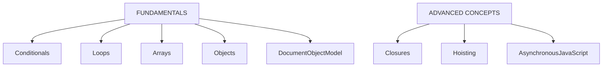
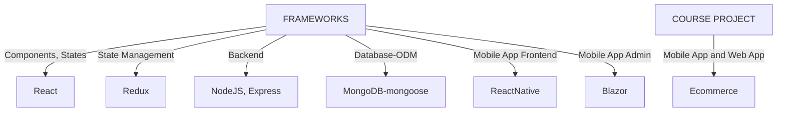

# Table of Contents
- [Agenda](#agenda)
- [Curriculum](#curriculum-layout)
- [Progress](#progress)
    - [Fundamentals](#fundamentals)
    - [Libraries/Frameworks](#librariesframeworks)
    - [Practice Project](#practice-project)
- [Course Project - Ecommerce](#course-project---ecommerce)
- [Learning Plan](#learning-plan)
- [Credits](#credits)
- [**Reasons to Repeat Project**](#reasons-to-repeat-project)

 

# Agenda
 - Learn Fundamentals of JavaScript, React JS, Redux, React Native
 - Learn Advanced concepts in JavaScript
 - Implement [Course Project](#course-project---ecommerce)
 - Check [Learning Plan](#learning-plan) for details

 

# Curriculum Layout
## Learning

 

## Project

- Learning *React JS* & *Redux* fundamentals would provide advantage in smooothening the learning curve with *React Native*

 - Check [Learning Plan](#learning-plan) for details

## Resources
- [Full Stack open](https://fullstackopen.com/en/) - Open University course for MERN stack
- [CS50 Web Programming (CS50 W)](https://youtube.com/playlist?list=PLhQjrBD2T380xvFSUmToMMzERZ3qB5Ueu&si=fESzUI9mLIPKQBlQ) - YouTube playlist
- [freeCodeCamp](https://www.freecodecamp.org/learn/javascript-algorithms-and-data-structures-v8/) - Learning through building projects

- [MDN](https://developer.mozilla.org/en-US/docs/Web/JavaScript), [W3Schools](https://www.w3schools.com/js/default.asp) - Documentation reference and Guidebook

 

# Progress
- Currently unraveling MERN stack with FullStack open - see [Repository](https://github.com/prak112/fullstack-open-core)

- See [Notes](NOTES.md)

## Fundamentals 
- **freeCodeCamp (fCC)** - Text-based Role Playing Game
    - [Source code](https://github.com/prak112/DevSchool-JavaScript/tree/text-rpg)
    - [Gameplay](https://prak112.github.io/DevSchool-JavaScript/)
- **CS50 W** 
    - [Implementation of concepts](https://github.com/prak112/cs50-webdev/tree/main/javascript) - based on [Lecture 5](https://youtu.be/x5trGVMKTdY?si=MYl_hguORRbdarCO)
- **Practice Exercises** 
    - [Algorithms practice](https://github.com/prak112/DevSchool-Javascript/tree/practice-problems/algorithms_practice) - based on [Top 10 Algorithms by fCC](https://youtu.be/ufBbWIyKY2E?si=UquSOoJ9zXHaU4Br)
    - Clearing confusions - [`for...in` Vs `for...of`](https://github.com/prak112/DevSchool-Javascript/tree/practice-problems/for-in_V_for-of) 

## Libraries/Frameworks
- ReactJS 
    - [Tutorial project, Fundamentals practice](https://github.com/prak112/DevSchool-Javascript/tree/react-js) - based on [React Documentation](https://react.dev/learn)
- Bootstrap
    - [Quick learning](https://github.com/prak112/DevSchool-Javascript/tree/bootstrap-parcel) - based on [Bootstrap Documentation](https://getbootstrap.com/docs/5.3/layout/breakpoints/)
 

## Practice Project
- [PokeDex](https://github.com/prak112/DevSchool-Javascript/tree/pokedex)
with basic functionality to understand :
    - JSON, 
    - API-Client interaction, 
    - Asynchronous JavaScript
    - Bootstrap 

 

[Back To Curriculum](#curriculum-layout)
 

# Course Project - Ecommerce
- 

    
Project Options
 

    <ul>
        <li> Source : <a href="https://www.linkedin.com/feed/update/urn:li:activity:6918166921565614080/">Danny Thompson, LinkedIn post</a>
        </li>
    </ul>

    1. 

        
<b>Furniture Ecommerce website</b>

        

            Basic : multiple products across multiple pages, a search feature, cart icon to add items to cart and on a separate page it stores that item and a checkout process.
        

        

            Advanced : Inventory Tracker. If only backend focused? Then create the inventory system for the store without the frontend. 
        

        

            Bonus : Inventory alert ONLY for smaller items BUT NOT for bigger items.
        

       

    2. 

        
<b>Restaurant website</b>

        

            Basic : Reservation system to book/reserve tables
        

        

            Advanced : Showcase value of business and stores info
        

        

            Bonus : Send email confirmation of reservation
        

       

    3. 

        
<b>Booking app for a service</b>

        

            Basic : Example, Mechanic shop with appointments for car repairs.
        

        

            Bonus : Track Financial inflow-outlfow, and visualize
        

       

    4. 

        
<b>Challenger - Bug Tracker</b>

        

            <ul> 
                <li>Show different stages of a Bug, tracking it along the process</li>
                <li>For example, display Bug going from 'backlog' to 'progress' to 'code review' to 'done'</li>
            </ul>
        

       

- Based on discussions/information from 
    - Teacher (Teemu Turunen), 
    - [Geek4Geeks](https://www.geeksforgeeks.org/introduction-react-native/?ref=lbp)

## Overview
- Web application (45 credits) will be with a responsive design
- Mobile application (15 credits) will be a **Hybrid Application**

| Ecommerce website | |
| --- | --- |
| *Design* | Based on [DevSchool-Project using Django](https://github.com/prak112/DevSchool-Project) |
| *Functionality* | -same as above- |
| *Tech Stack* | MERN (*MongoDB-mongoose, Express, React/ReactNative, NodeJS*) |
| | |

## Mobile Application (15 Credits)
- After [unraveling MERN stack](https://github.com/prak112/fullstack-open-core#goal) with Full Stack open : 
    - Parts 0-7, 
    - Part 9 (*TypeScript*) and 
    - Part 10 (*ReactNative*)
- Ecommerce mobile app using **MERN** (*ReactNative*) and *Blazor*<!--prep/check local 15osp README -->
- Admin page (using Blazor WebAssembly in C# ) <!--prep/check local 15osp README -->
- ...*WIP*... - Detailed implementation plan

## Web Application (45 Credits)
- After [unraveling MERN stack core](https://github.com/prak112/fullstack-open-core#goal) with Full Stack open ( Parts 0-7 )
- Ecommerce website using **MERN**
- ...*WIP*... - Detailed implementation plan 
 <!--prep/check local 45osp README -->
 

## Technology Requirements

<table style="border: 1px solid; border-collapse: collapse;">
    <tr>
        <th>Hosting Platforms</th>
        <td>iOS, Android, Web</td>
    </tr>
    <tr>
        <th>Frontend</th>
        <td>React v18.x, Bootstrap5</td>
    </tr>
    <tr>
        <th>Backend</th>
        <td>Express v4.x, React Native v0.74, NodeJS v20.x</td>
    <tr>
    <tr>
        <th>Database</th>
        <td>MongoDB Server v5.2.x, mongoose ODM v8.x</td>
    <tr>
    <tr>
        <th>IDE</th>
        <td>VS Code</td>
    </tr>
    <tr>
        <th>API Testing (<i>extensions</i>)</th>
        <td>Postman v1.0.1, REST client v0.25.1</td>
    </tr>
    <tr>
        <th>Application Testing (<i>extensions</i>)</th>
        <td>Android Emulator, iOS Simulator or MobileView</td>
    </tr>
    <tr>
        <th>Debugging</th>
        <td>Chrome, VS Code Debugger, React Native Debugger(<i>extension</i>)</td>
    </tr>
</table>

 

[Back To Curriculum](#curriculum-layout)
 

# Learning Plan

- Learnings from FullStack open will be implemented for Course Projects ([*15 credits*](#15-credits---mern-using-reactnative-and-aspnet), [*45 credits*](#45-credits---mern))
- Below is an exhaustive list of current learnings and their progress ( [progress details](/NOTES.md) )

## JavaScript Fundamentals
- [X] Variables, Data Types, Operators, Control Structures (if/else, switch, loops)
- [X] Function Declarations, Function Expressions, Arrow Functions, Parameters, Return Values
- [X] Creating Arrays, Accessing Array Elements, Array Methods (map, filter, reduce), Spread/Rest Operators
- [X] Creating Objects, Accessing Object Properties, Object Methods, Object Destructuring
- [X] Global Scope, Local Scope, Block Scope, Hoisting, Lexical Scope
- [X] Closure Concept, Scope Chain, Practical Use Cases
- [X] Promises, Async/Await, Fetch API, Handling Asynchronous Operations
- [X] Understanding DOM, Selecting DOM Elements, Manipulating DOM Elements, Event Handling

## React Basics
- [X] JSX syntax
- [X] Creating Components, Rendering Components, Props
- [X] State, setState, 
- [X] Class Components vs Functional Components
- [ ] componentDidMount, componentDidUpdate, componentWillUnmount
- [X] Handling Events, Synthetic Events in React
- [X] Conditional Rendering using if statements and ternary operators
- [X] Rendering Lists, Keys in React

## ES6 Features, Functional Programming
- [X] Arrow Functions Syntax, Lexical `this`
- [X] Object Destructuring, Array Destructuring
- [X] Spread Syntax, Rest Parameters
- [X] Class Syntax, Constructors, Class Inheritance
- [X] Exporting and Importing Modules, Default and Named Exports
- [X] Function Composition
- [X] Immutable Data Structures, Benefits of Immutability

## JavaScript Objects
- [X] Basics
- [X] Prototypes
- [X] Prototypal 'Inheritance' (Delegation)
- [X] Classes
- [X] Instances, Inheritance, Encapsulation
- [X] Prototype vs Class
- [X] JSON

## Asynchronous JavaScript
- [X] Creating Promises, Chaining Promises, Error Handling
- [X] Async/Await Syntax, Handling Errors, Async Function Expressions
- [X] Making HTTP Requests, Handling Responses, Error Handling
- [ ] Parallel and Sequential Execution, Promise.all, Promise.race

## Redux
- [ ] Store Creation, Store Methods, getState, dispatch, subscribe
- [ ] Action Types, Action Creators, Payload
- [ ] Reducer Functions, Pure Functions, Handling State Updates
- [ ] Thunk, Saga, Logger Middleware
- [ ] Immutability, Immutable.js Library (optional)

## Bootstrap 
(check [detailed plan](https://github.com/prak112/DevSchool-Javascript/tree/bootstrap-parcel?tab=readme-ov-file#learning-checklist) )	
- [X] Grid System
- [ ] Components
- [ ] Utilities

 

[Back To Curriculum](#curriculum-layout)
 

# Credits
- Planning Assistance  - **ChatGPT 3.5**
- Learning Assistance :
    - 
    - **GitHub CoPilot**
 

 

# Reasons to Repeat Project
- To identify differences and significance between frameworks (**Django**, **MERN**)
- To be able to visualize stakeholders's needs in different frameworks' perspective
- More elaborately to :
1. **Understand Core concepts** and **Versatility**
    - Web Development is all about agility and adapting, hence to familiarise with syntax and functional pecularities amongst frameworks
2. **Evaluate Frameworks**
    - Helps to evaluate strengths and weaknesses of each framework to decide when to use which
3. **Learn through Mastery**
    - Repetition leads to reinforced learning and deeper understanding
4. **Enhance Problem Solving**
    - Adapting to diverse frameworks while maintaining controlled parameters enhances problem-solving skills.
5. **Learn Best Practices**
    - Learn best possible ways to work with each framework
6. **Boost Confidence**
    - All of the above combined leads to confidence boosting as a Software Developer!
 

[Back To Curriculum](#curriculum-layout)
 

