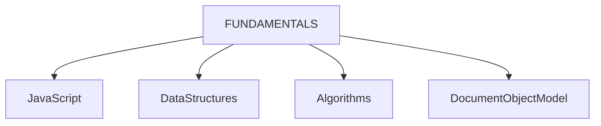
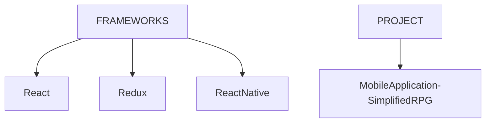

# Agenda
 - Learn Fundamentals of Javascript, Data structures, Algorithms, DOM

# Sources
- [freeCodeCamp](https://www.freecodecamp.org/learn/javascript-algorithms-and-data-structures-v8/) - Learning through building projects
    - Project 1 - [Role Playing Game](fcc_role-playing-game)
- [MDN](https://developer.mozilla.org/en-US/docs/Web/JavaScript) - Documentation reference and Guidebook

# Current Focus

# Future Focus

 

# Mobile Application Development - Simplified RPG
## Technology Requirements
- Requirements listed from discussions with :
    -   Teacher (Teemu Turunen), 
    -   [Bing AI](https://sl.bing.net/dEhXls9KsqO), 
    -   [Geek4Geeks](https://www.geeksforgeeks.org/introduction-react-native/?ref=lbp)

- [X] Installation of NodeJS
- [ ] Basic knowledge in ReactJS 
- [ ] Basic knowledge in ReactNative

## Overview
- The Role Playing Game (RPG) will be a **Hybrid Application** with the following specifications 

<table style="border: 1px solid; border-collapse: collapse;">
    <tr>
        <th>Hosting Platforms</th>
        <td>iOS, Android</td>
    </tr>
    <tr>
        <th>Frontend</th>
        <td>HTML5, CSS, Javascript</td>
    </tr>
    <tr>
        <th>Backend</th>
        <td>React Native</td>
    <tr>
    <tr>
        <th>IDE</th>
        <td>VS Code</td>
    </tr>
    <tr>
        <th>Testing (<i>extensions</i>)</th>
        <td>Android Emulator, iOS Simulator or MobileView</td>
    </tr>
    <tr>
        <th>Debugging (<i>extensions</i>)</th>
        <td>React Native Debugger</td>
    </tr>
</table>

 

## Storyline
... **TBD** ...
