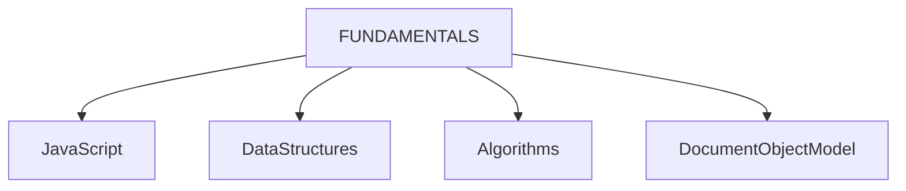
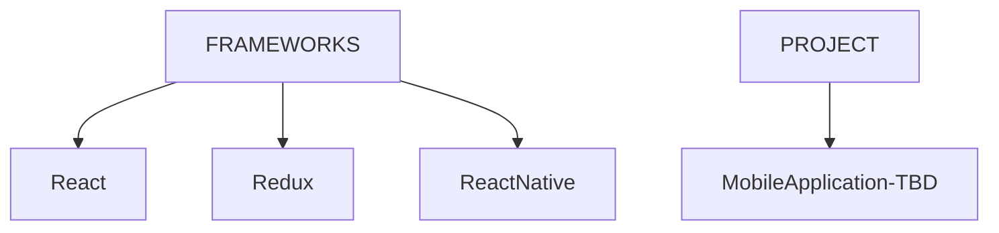

# Agenda
 - Learn Fundamentals of Javascript, Data structures, Algorithms, DOM

# Sources
- [freeCodeCamp](https://www.freecodecamp.org/learn/javascript-algorithms-and-data-structures-v8/)
- [MDN](https://developer.mozilla.org/en-US/docs/Web/JavaScript)

# Current Focus

# Future Focus

