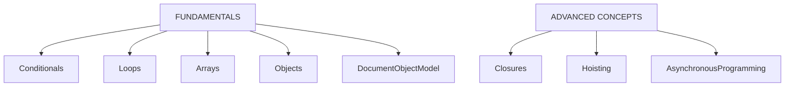
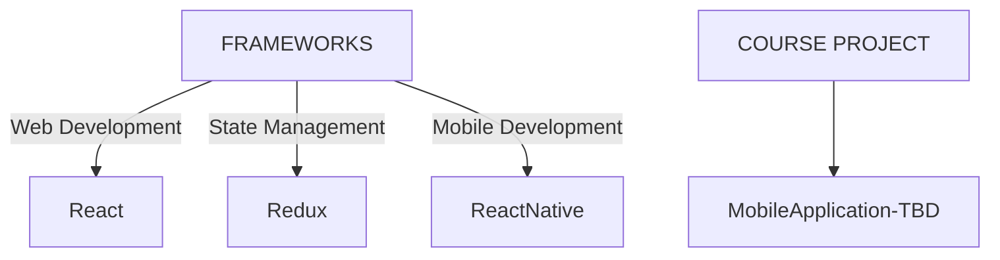

# Agenda
 - Learn Fundamentals of Javascript, React JS, Redux, React Native
 - Learn Advanced concepts in Javascript
 - Implement [Course Project](#course-project---tbd)
 - Check [Learning Plan](#learning-plan) for details

# Resources
- [CS50 Web Programming (CS50 W)](https://youtube.com/playlist?list=PLhQjrBD2T380xvFSUmToMMzERZ3qB5Ueu&si=fESzUI9mLIPKQBlQ) - YouTube playlist
- [freeCodeCamp](https://www.freecodecamp.org/learn/javascript-algorithms-and-data-structures-v8/) - Learning through building projects

- [MDN](https://developer.mozilla.org/en-US/docs/Web/JavaScript) - Documentation reference and Guidebook

 

# Progress
- See [Notes](NOTES.md)

- Javascript Fundamentals practice 
    - **freeCodeCamp** - Text-based Role Playing Game
        - Check [Project](https://github.com/prak112/DevSchool-Javascript/tree/text-rpg)
        - [Play](https://prak112.github.io/DevSchool-Javascript/)
    - **CS50 W** 
        - [Implementation of concepts](https://github.com/prak112/cs50-webdev/tree/main/javascript)

 

# Current Focus

# Future Focus

- Learning *React JS* & *Redux* fundamentals would provide advantage in smooothening the learning curve with *React Native*

 - Check [Learning Plan](#learning-plan) for details

 

# Course Project - TBD
- To decide between Simplified RPG or Week Planner or Booking System

## Technology Requirements
- Requirements listed from discussions with :
    -   Teacher (Teemu Turunen), 
    -   [Bing AI](https://sl.bing.net/dEhXls9KsqO), 
    -   [Geek4Geeks](https://www.geeksforgeeks.org/introduction-react-native/?ref=lbp)

- [X] Installation of NodeJS
- [ ] Basic knowledge in ReactJS, Redux
- [ ] Basic knowledge in ReactNative

## Overview
- The mobile application will be a **Hybrid Application** with the following specifications 

<table style="border: 1px solid; border-collapse: collapse;">
    <tr>
        <th>Hosting Platforms</th>
        <td>iOS, Android</td>
    </tr>
    <tr>
        <th>Frontend</th>
        <td>HTML5, TailwindCSS, Javascript</td>
    </tr>
    <tr>
        <th>Backend</th>
        <td>React Native</td>
    <tr>
    <tr>
        <th>IDE</th>
        <td>VS Code</td>
    </tr>
    <tr>
        <th>Testing (<i>extensions</i>)</th>
        <td>Android Emulator, iOS Simulator or MobileView</td>
    </tr>
    <tr>
        <th>Debugging (<i>extensions</i>)</th>
        <td>React Native Debugger</td>
    </tr>
</table>

 

# Learning Plan
- Mastering these concepts is considered essential for a structured path to effectively learn and implement the development of the Mobile Applicaiton using React Native, Redux, and Tailwind CSS.

## Javascript Fundamentals
- [X] Variables, Data Types, Operators, Control Structures (if/else, switch, loops)
- [X] Function Declarations, Function Expressions, Arrow Functions, Parameters, Return Values
- [X] Creating Arrays, Accessing Array Elements, Array Methods (map, filter, reduce), Spread/Rest Operators
- [ ] Creating Objects, Accessing Object Properties, Object Methods, Object Destructuring
- [X] Global Scope, Local Scope, Block Scope, Hoisting, Lexical Scope
- [X] Closure Concept, Scope Chain, Practical Use Cases
- [X] Promises, Async/Await, Fetch API, Handling Asynchronous Operations
- [X] Understanding DOM, Selecting DOM Elements, Manipulating DOM Elements, Event Handling

## React Basics
- [ ] JSX syntax
- [ ] Creating Components, Rendering Components, Props
- [ ] State, setState, Class Components vs Functional Components
- [ ] componentDidMount, componentDidUpdate, componentWillUnmount
- [ ] Handling Events, Synthetic Events in React
- [ ] Conditional Rendering using if statements and ternary operators
- [ ] Rendering Lists, Keys in React

## ES6 Features, Functional Programming
- [X] Arrow Functions Syntax, Lexical `this`
- [ ] Object Destructuring, Array Destructuring
- [ ] Spread Syntax, Rest Parameters
- [ ] Class Syntax, Constructors, Class Inheritance
- [ ] Exporting and Importing Modules, Default and Named Exports
- [ ] Functions as First-Class Citizens, Function Composition
- [ ] Immutable Data Structures, Benefits of Immutability

# Javascript Objects
- [ ] Basics
- [ ] Prototypes
- [ ] Object-oriented Programming - instances, Inheritance, Encapsulation
- [ ] Classes
- [ ] JSON

## Asynchronous JavaScript
- [ ] Creating Promises, Chaining Promises, Error Handling
- [ ] Async/Await Syntax, Handling Errors, Async Function Expressions
- [ ] Making HTTP Requests, Handling Responses, Error Handling
- [ ] Parallel and Sequential Execution, Promise.all, Promise.race

## Redux
- [ ] Store Creation, Store Methods, getState, dispatch, subscribe
- [ ] Action Types, Action Creators, Payload
- [ ] Reducer Functions, Pure Functions, Handling State Updates
- [ ] Thunk, Saga, Logger Middleware
- [ ] Immutability, Immutable.js Library (optional)

## Tailwind CSS	
- [ ] Utility Classes, Tailwind CSS Configuration
- [ ] Responsive Classes, Media Queries
- [ ] Customizing Tailwind CSS, Creating Custom Utility Classes
- [ ] Tailwind CSS Plugins, Integration with Build Tools

 

# Credits
- Planning Assistance  - **ChatGPT 3.5**
- Learning Assistance :
    - 
    - **Github CoPilot**